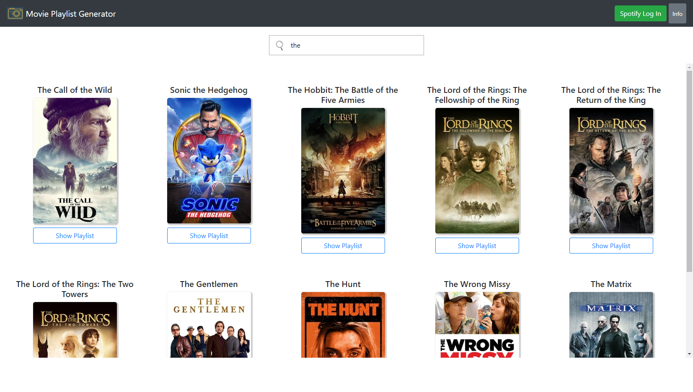
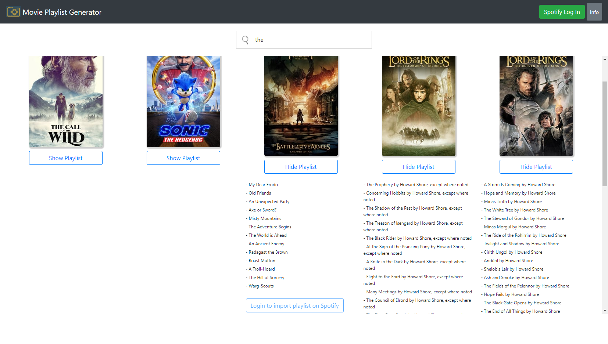

# Movie Playlist Generator

A website that automatically creates a Spotify playlist with your favorite movie soundtrack, just name it!

## Screenshots

<p align="center">
   
   
</p>

## Getting started

This procedure describes how to launch the application in a development or testing environment, with client and server on the same machine.

### Clone the repo
```
git clone https://github.com/nicolecogo/movie-playlist
cd movie-playlist
```

### Set up server
1. Install server dependencies from _server_ directory
```
npm install
```

2. Set up the environment variables in the server: copy the example ```.env``` file and replace variables (see instructions bellow on how to acquire necessary third party credentials)
```
cp example.env .env
```

3. Launch the server
```
node index.js
```

<details>
<summary><b>Show instructions for setting up server environment variables</b></summary>

</details>

### Set up client
1. Install client dependencies from _client_ directory
```
npm install
```

2. Set up the environment variables in the client: copy the example ```.env``` file and replace variables (see instructions bellow on how to acquire necessary third party credentials)
```
cp example.env .env
```

3. Launch the client. A browser should open with the app. Enjoy!
```
npm start
```

<details>
<summary><b>Show instructions for setting up client environment variables</b></summary>

</details>

## The project

This website was retouched as part of a Legacy Project for a software engineering bootcamp. Several front-end tests were implemented using Jest, and some features were added to the original product, besides reestructuring and refactoring the code. The [original version](https://github.com/pierandread/soloProject-MoviePlaylist) was idealized and developed by [Pier](https://github.com/pierandread).

## Tech stack

<b>Front-end</b>

* [React](https://reactjs.org/)
* [Redux](https://redux.js.org/)

<b>Back-end</b>

* [Node.js](https://nodejs.org/en/)
* [Express](https://expressjs.com/)

<b>Services (APIs and libraries)</b>

* [Spotify Web API](https://developer.spotify.com/documentation/web-api/)
* [TMDB API](https://www.themoviedb.org/documentation/api)
* [wtf_wikipedia](https://github.com/spencermountain/wtf_wikipedia)

<b>Testing</b>

* [Jest](https://jestjs.io/)

## Contributors

- Pier Andrea Delise - [github](https://github.com/pierandread)
- Anthony Candaele - [github](https://github.com/acandael)
- Scott Burgess - [github](https://github.com/Scottburg)
- Nicole Carrion Cogo - [github](https://github.com/nicolecogo)